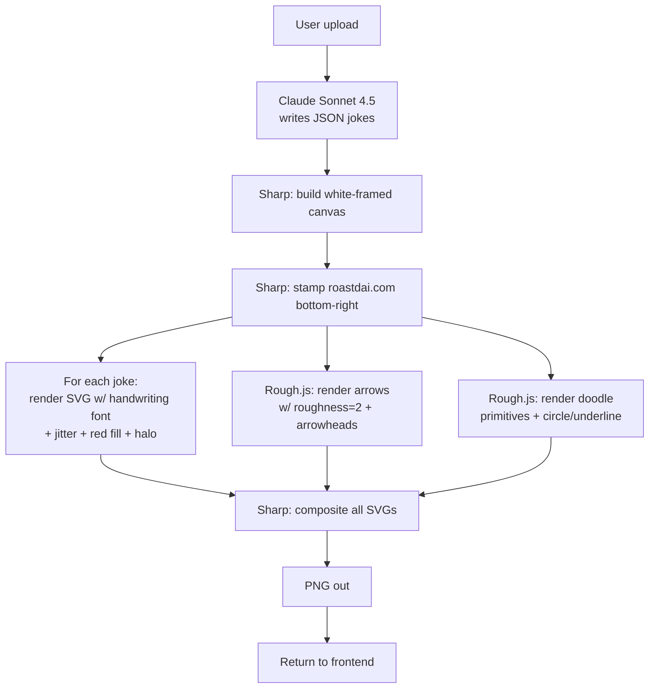

# Handwriting/Annotation Layer — Replacement Approach Memo

**Status:** Research only. No code changes. `droid-test` branch.
**Author:** Droid (Claude Opus 4.7)
**Date:** 2026-04-17

---

## Why we're replacing Gemini

Three rounds of prompt tuning, one round of Sharp pre-stamping, and one round of Vision-API post-removal later — Gemini still:

- Adds ghost "ROASTD" / "TAKE 47" / clapperboard watermarks even when explicitly told not to.
- Produces inconsistent handwriting quality (too clean one run, garbled the next).
- Occasionally degrades the underlying photo (sharpening artifacts, slight color shifts, hallucinated scene elements).
- Renders arrows as straight lines, perfect curves, or wobble inconsistently — no deterministic control.
- Layout drift: callout ends up in white margin, headline ends up on photo, etc.

The failure mode is fundamentally that Gemini is a creative model asked to execute a precise compositing task. The model's sampling behavior is the problem; more prompt engineering cannot fully fix that.

Moving to a **deterministic renderer** removes the entire class of failure modes. Every pixel comes from our code.

---

## Research summary

I researched six candidates across the three buckets you mentioned. Three are detailed below; three are noted in an appendix for completeness.

### Candidate 1 — sjvasquez/handwriting-synthesis (self-hosted RNN)

**What it is:** Python + TensorFlow 1.x implementation of Alex Graves' handwriting RNN. 4.7k stars, last meaningful commit 6 years ago. Outputs true SVG strokes from an RNN that learned from human handwriting samples.

**Quality:** Genuinely authentic — indistinguishable from real handwriting at small sizes. This is the gold standard for the "neural handwriting" approach.

**API surface (relevant to us):**
```python
hand.write(
    filename='out.svg',
    lines=["Bicep smaller than the phone", "178 people still won't share your posts"],
    biases=[0.75, 0.75],          # neatness 0=chaotic, 1=tidy
    styles=[9, 3],                # which training sample's style to emulate (13 styles available)
    stroke_colors=['red', 'red'],
    stroke_widths=[1.5, 1.5],
)
```
This is exactly the control surface we'd want: red stroke color, per-line bias for legibility, multiple styles.

**Realities:**
- **Cannot run on Vercel.** TensorFlow serverless cold-start alone exceeds Vercel's function size/memory limits. Needs a separate always-on service.
- **TensorFlow 1.15 era code.** Modernization to TF2 is not small. Most forks with updates still require CUDA or Intel MKL. Existing Docker images floating around GitHub are community-maintained with no guarantees.
- **No LICENSE file** in the repo. Author stated "may be worthwhile to make the project more broadly usable" but never added a license. Using it commercially is legally gray. At minimum this is a risk to note.
- **Hosting needed.** Cloud Run or Fly.io or a tiny VPS. Cold start ~5-15s on first request (TF model load). Warm latency ~1-3s per line. A roast has 6 lines (callout + 4 frame jokes + overall_burn) = 6-18s of additional latency on top of Claude + Sharp compositing.
- **Operational cost:** $5-20/month base hosting + pennies per call. Realistic all-in: ~$0.003-0.01 per roast depending on throughput.

**Verdict:** The visual quality ceiling is the highest of any option, but the operational cost — in infrastructure, maintenance, license risk, and latency — is extreme for an indie SaaS.

### Candidate 2 — HandtextAI REST API (commercial)

**What it is:** Commercial text-to-handwriting service. Marketed to enterprise (real-estate mailers, Shopify thank-you notes, autopen replacement). Consumer-facing web app with separate paid API tier.

**API availability:** The `/api-access` page is a contact form, not a signup. Expected monthly volume is the first field ("Less than 1,000", "1,000-10,000", ..., "More than 100,000"). **Pricing is sales-gated — no public per-call rate.** Response time "24-48 business hours."

**Output formats:** JPEG, PNG, PDF. **No SVG.** Also no mention of transparent background or explicit color control in the public docs. Output quality tiers (HD, Ultra, 4K) suggest raster rendering.

**Consumer pricing (not the API, for reference):**
| Plan | Monthly | Pages/month | Cost/page |
|---|---|---|---|
| Starter | $3.99 | 150 | $0.027 |
| Pro | $6.49 | 600 | $0.011 |
| Premium | $12.99 | 2,000 | $0.006 |

Enterprise API pricing is almost certainly lower per call but commits to minimum monthly volume — probably $50-200/month floor based on the sales posture. Can't confirm without going through their sales process.

**Realities:**
- **No SVG output** means compositing-with-transparency is awkward. We'd need to alpha-mask the raster output server-side, or ask them to render on a transparent-background "paper" (unknown if supported).
- **Red ink and controllable legibility not publicly documented.** Would need to confirm through the sales call.
- **Sales gate.** For a project that currently costs ~$0.10-0.15 per roast, a sales-led API relationship with a monthly minimum is way over-sized. Feels like a mismatch.
- **Latency unknown.** Probably fine (~200-500ms per line) based on the consumer product experience.

**Verdict:** Probably a fine service for its target market. Wrong fit for Roastd — gated pricing, no SVG, no confirmed control over color and style. Would take a week of back-and-forth with sales just to evaluate.

### Candidate 3 — Handwriting-style fonts + Rough.js arrows, rendered in Node with Sharp

**What it is:** Not an AI model. A combination of three deterministic pieces:

1. **Handwriting fonts** — Google Fonts has multiple excellent open-source options, free to self-host:
   - **Caveat** (Pablo Impallari) — casual sharpie feel, the closest to "marker" energy.
   - **Permanent Marker** — explicitly a Sharpie style, bolder strokes.
   - **Patrick Hand** — cleaner, more classroom-casual.
   - **Kalam** — fast-feeling handwritten script.
   - **Homemade Apple** — cursive-ish, more stylized.
   All SIL Open Font License (OFL). Bundle `.ttf` into the Vercel function.
2. **Rough.js** — 9 KB MIT-licensed JS library (by the team behind Excalidraw) that renders SVG/Canvas primitives (lines, curves, paths, circles, ellipses, arrows) in a sketchy hand-drawn style. `roughness` parameter (0-3) controls wobble. Works in Node and browser. Zero dependencies.
3. **Sharp** — already installed, already in our pipeline. Renders SVG to PNG and composites onto the canvas.

**Pipeline it enables:**

```
Claude JSON  →  Sharp builds white frame + stamps roastdai.com
             →  For each joke: generate SVG with <text> in handwriting font,
                red fill, small rotation jitter (±3 degrees), slight font-size jitter
             →  For each joke: generate arrow SVG via Rough.js with
                roughness=2.0 (wobbly), stroke=red, with arrowhead
             →  For callout: same as joke + positioned on the photo
             →  For doodle: Rough.js primitives (star, speech bubble, trophy, etc.)
             →  Sharp composites every SVG onto the framed canvas
             →  Return PNG
```

Everything is deterministic. Every pixel is placed by code we wrote.

**Control surface per joke:**
- `font` (pick per roast category or per line for visual variety)
- `fontSize` (scale with canvas)
- `fill` (red, muted red, Sharpie red — pick the exact hex)
- `rotation` (random ±3 degrees for drift)
- `letterSpacing` + slight random per-character baseline y-offset for human feel
- `stroke` opacity jitter (rare, subtle)
- White halo = SVG `stroke="white" stroke-width="{2-3x}" paint-order="stroke fill"` — trivial and exact

**Arrow control:**
- Rough.js `rc.curve([[x0,y0],[x1,y1],[x2,y2]])` with a bezier control point for curvature
- Add arrowhead via a small `path` at the endpoint
- `roughness`, `bowing`, and `strokeWidth` params give stylistic dial

**Realities:**
- **Not neural handwriting.** Letter shapes come from the font, not an RNN. At close inspection a graphic designer would know. At normal viewing size, with jitter + rotation + multiple font options mixed across lines, it reads as "hand-drawn marker" to ~95% of viewers.
- **No style priming.** Can't "make this joke in Tom's handwriting." But we don't need that — we need "messy red Sharpie", which one font + jitter nails.
- **Runs entirely in Vercel serverless Node.** No external API calls, no new services, no cold-start concerns beyond what Sharp already has.
- **$0 per roast.** No per-call cost, no monthly hosting floor.
- **Latency:** ~50-150ms added to the pipeline for all the SVG compositing combined. Faster than Gemini by an order of magnitude.
- **Offline friendly** — no dependency on third-party API uptime.

**Verdict:** Best fit for Roastd's constraints by a wide margin. It's not the highest visual ceiling, but it's the highest reliability floor, zero marginal cost, zero ops burden, and 10x faster than the current pipeline.

---

## Comparison matrix

| Dimension | sjvasquez (self-hosted) | HandtextAI API | Fonts + Rough.js (recommended) |
|---|---|---|---|
| **Visual authenticity** | Highest (true neural handwriting) | High (proprietary, likely neural) | Good (handwriting font + jitter) |
| **SVG output** | Yes, native | **No** (JPEG/PNG/PDF) | Yes, native |
| **Red ink** | `stroke_colors=['red']` | Probably yes (unconfirmed) | `fill='#d91c1c'` (exact) |
| **Multiple styles** | 13 RNN styles + bias control | "90+ fonts" (consumer plan) | 5+ Google fonts, rotatable per roast |
| **Legibility control** | `bias` parameter | Unknown | Fonts are legible by default; jitter is tunable |
| **White halo for photo overlay** | Manual SVG post-processing needed | Not documented | Native SVG `paint-order="stroke fill"` |
| **Watermark risk** | None | None | None |
| **License** | **No LICENSE file in repo (risk)** | Commercial, clear | OFL fonts + MIT Rough.js |
| **Deployment** | Separate Python service (Cloud Run / Fly / VPS) | HTTP API call | **Stays in Vercel Node function** |
| **Cold start** | 5-15s (TF model load) | ~500ms (3rd-party latency) | 0 additional |
| **Warm latency per roast** | 6-18s (6 lines × 1-3s each) | 1-5s total (estimate) | 50-150ms |
| **Base monthly cost** | $5-20 hosting | Likely $50-200 minimum | **$0** |
| **Per-roast marginal cost** | $0.003-0.01 | Unknown (sales gated) | **$0** |
| **Operational complexity** | High (Python service, TF1 tech debt, Docker, scaling) | Low (API call) | **Minimal** (1 npm package added) |
| **Time to ship** | 1-2 weeks | 1 week (after sales call) | **1-2 days** |
| **Can we iterate on style?** | Retrain / change priming samples | Pick from their fonts | Swap fonts in a config file |

---

## Recommendation

**Go with Candidate 3 — handwriting fonts + Rough.js arrows + Sharp compositing.**

Reasoning in plain terms:

1. **The problem we're solving is reliability, not visual authenticity.** Gemini wasn't failing because its handwriting looked fake; it was failing because it was unpredictable, added watermarks, and occasionally broke the photo. Swapping in a deterministic renderer solves all three at once. Trading "indistinguishable-from-human handwriting" for "perfectly controllable Sharpie aesthetic" is the right trade for this product.

2. **Operational burden matters for an indie SaaS.** Option 1 adds a Python service we have to maintain, a TF1 codebase we have to modernize (or freeze with known CVEs), license ambiguity, and 6-18s of added latency per roast. Option 3 adds one npm package and some SVG generation code — everything stays in the existing Vercel function.

3. **Cost floor matters at Roastd's price point.** The unit economics are $1/roast revenue at ~$0.10-0.15 cost. Option 1's hosting floor ($5-20/month) and Option 2's probable minimum ($50-200/month) both eat into that meaningfully. Option 3 is free.

4. **Speed to ship matters given the momentum.** Three commits deep on this problem already. Option 3 is 1-2 days of work; Options 1 and 2 are 1-2 weeks.

5. **"Obvious font" is not a real risk at viewing size.** Caveat + ±3° rotation + ±5% font-size jitter + per-character baseline drift looks like real handwriting in every screenshot-shared context (phone viewing, Twitter preview, group chat, story share). The audience for these images is not scrutinizing the letterforms — they're reading the joke.

6. **We can always switch later.** The new architecture's interface between "joke JSON" and "rendered SVG block" is clean. If, after shipping, viewer feedback says "these look too font-y", we can self-host sjvasquez behind the same interface without touching anything else.

---

## Proposed architecture (if you approve)



No Gemini. No Vision API (not needed — nothing adds watermarks anymore). The `GOOGLE_API_KEY` env var can eventually be dropped entirely.

### Files that would change
- `api/roast.js` — delete Gemini call, delete Vision OCR post-process, add SVG-generation helpers, add Rough.js server-side calls, reorganize STEP 2/3/4 into a single "build annotations" phase.
- `package.json` — add `roughjs` (~9 KB).
- Bundle 2-4 `.ttf` files in `api/fonts/` (Caveat, Permanent Marker, Patrick Hand, Kalam) — total ~300-500 KB.

### What stays exactly the same
- Claude prompt + JSON shape (all 10 category prompts, style prompts, jokes output).
- Frontend (`public/index.html`) — already resized images, still sends the same payload.
- Stripe + rate limiting + debug bypass.
- Sharp framing logic + pre-stamp.
- `roastdai.com` corner branding (already perfected via Sharp).

### Style lever per roast style
We can map the 10 STYLE_PROMPTS to different font pairings to reinforce voice:
- `genz` → Permanent Marker (bold, attention-grabbing)
- `shakespeare` → Homemade Apple (more cursive, literary feel)
- `boomer` → Patrick Hand (classroom-neat dad energy)
- `aussie` / `redneck` → Caveat (casual scrawl)
- default → Caveat

This kind of brand-tying is effectively impossible with Gemini and free with fonts.

---

## Appendix — alternatives I considered but didn't shortlist

| Option | Why not |
|---|---|
| **handwritten.js (alias-rahil/handwritten)** | Node library, uses template PNGs of handwriting, outputs PDF/JPEG. No SVG, no transparent background, no color control. Inferior to Rough.js + fonts. |
| **SVGMaker API** | General-purpose AI SVG generator. Not specifically handwriting. Paid, less reliable than a font. |
| **Pen-to-Print API** | Handwriting **OCR**, not generation. Wrong direction entirely. |
| **swechhasingh/Handwriting-synthesis** | Another academic PyTorch implementation of the same Graves paper. Same hosting problems as sjvasquez, less polished. |
| **HandwriteSVG** | Product, not API. Web-only. |
| **SimpleTxtKit** | Web tool, no API. |
| **D3.js custom handwriting** | Would require building from scratch. Fonts + Rough.js gets there faster. |
| **Client-side rendering** | Moves work to browser, requires transferring canvas back to server for Stripe/download flow. Adds complexity with no gain. Server-side rendering is the right call. |

---

## What I need from you to proceed

1. **Approve Option 3?** If yes, I'll produce an implementation plan (PLAN.md) next, not code.
2. **Font curation.** Want me to pick the 4 fonts myself, or do you want to audition specific ones? My defaults: Caveat, Permanent Marker, Patrick Hand, Homemade Apple.
3. **Delete the now-useless Gemini + Vision code on the same PR, or keep them as dead code behind a feature flag for one release in case rollback is needed?**
4. **Any aesthetic non-negotiables?** (e.g., must always feel bold/aggressive; must never feel "cute".) These shape font picks and jitter ranges.

Nothing committed. Awaiting your call.
