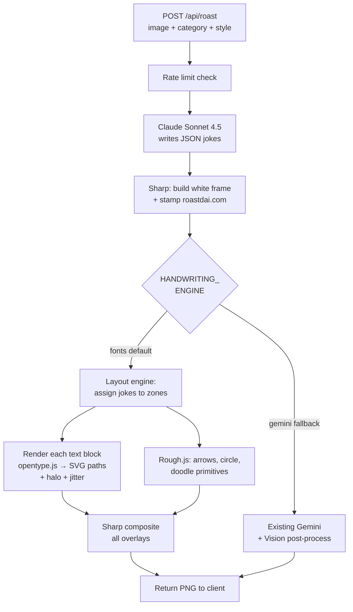

# Implementation Plan — Handwriting Engine Swap (Gemini → Fonts + Rough.js)

**Branch:** `droid-test`
**Decision inputs (all approved):** Set B font pairing · per-style joke-font mapping · feature-flagged rollout · Gemini path kept as fallback until 20+ real roast validation.
**Constraints reiterated:** red ink only · universal white halo · curved wobbly arrows · `roastdai.com` small bottom-right · no changes to Claude JSON shape · no changes to frontend, Stripe, rate limiting.

---

## 1. Summary

Replace the Gemini annotation step with a deterministic server-side renderer: handwriting fonts (via opentype.js → SVG glyph paths) + Rough.js (for arrows, circles, and the small sketch doodle) + Sharp (for final compositing). Keep the Gemini path intact behind a feature flag for one release cycle. All rendering stays inside the existing Vercel serverless function. No external APIs. No new hosting.

---

## 2. New architecture



---

## 3. Files to change or add

### Modified
- **`api/roast.js`** — add feature-flag branch, keep Gemini path intact, call into new font-renderer helpers.
- **`package.json`** — add `opentype.js` (~80 KB) and `roughjs` (~9 KB gzipped).

### Added
- **`api/lib/handwriting.js`** — new module. Exports:
  - `loadFonts()` — lazy-loads and caches TTFs from `api/fonts/`.
  - `renderHandwrittenText({ text, font, fontSize, color, rng, rotation, baselineJitter, sizeJitter, strokeHaloRatio })` — returns `{ svg, width, height }`.
  - `renderWobblyArrow(from, to, rng, opts)` — uses Rough.js with bezier control points.
  - `renderWobblyCircle(cx, cy, rx, ry, rng, opts)`.
  - `renderDoodle(centerX, centerY, hint, rng)` — picks a shape family (star, speech bubble, trophy, price tag, exclamation burst) based on `roastData.sketch_idea` keyword matching; renders via Rough.js.
- **`api/lib/layout.js`** — pure layout engine. Given canvas dims and joke count, returns per-joke target zones (`{ textAnchor, arrowFrom, arrowTo, rotationDeg }`).
- **`api/lib/rng.js`** — tiny seeded PRNG used everywhere jitter is applied (so the same roast JSON + same seed gives the same image; useful for reproducing bugs).
- **`api/fonts/PermanentMarker-Regular.ttf`** (~75 KB)
- **`api/fonts/Caveat-Variable.ttf`** (~400 KB)
- **`api/fonts/PatrickHand-Regular.ttf`** (~215 KB)
- **`api/fonts/Kalam-Regular.ttf`** (~427 KB)
- **`api/fonts/ArchitectsDaughter-Regular.ttf`** (~43 KB)
- **`api/fonts/LICENSE-FONTS.md`** — single doc listing OFL + Apache license attributions for the bundled fonts.

### Unchanged
- `public/index.html` (frontend)
- `api/checkout.js`, `api/verify.js`
- `api/roast.js` Claude prompt and JSON schema
- `api/roast.js` Sharp framing + `roastdai.com` pre-stamp
- Rate limiting, debug bypass, Stripe integration
- `vercel.json`

---

## 4. Dependencies

Add to `package.json`:
```json
{
  "dependencies": {
    "sharp": "^0.33.2",
    "stripe": "^17.5.0",
    "opentype.js": "^1.3.4",
    "roughjs": "^4.6.6"
  }
}
```

Total serverless bundle impact:
- opentype.js: ~80 KB
- roughjs: ~90 KB unpacked
- Fonts: ~1.16 MB total

Net: ~1.3 MB added. Current `api/roast.js` function bundle is ~14 MB (mostly Sharp). New total ~15.3 MB — well under Vercel's 50 MB compressed / 250 MB uncompressed limit.

---

## 5. Font asset management

- Commit all five TTF files under `api/fonts/`. Google Fonts (OFL and Apache 2.0 licenses) permit redistribution.
- `LICENSE-FONTS.md` in that directory documents the attribution for each file.
- Vercel's `@vercel/node` builder bundles everything in `api/` including non-code assets, so fonts ship with the function automatically. No `vercel.json` tweak needed.
- At cold start, `loadFonts()` loads all TTFs with `opentype.loadSync(…)` once and caches them on `globalThis`. Warm starts reuse the cache — ~0 overhead after first request.

---

## 6. Feature flag design

Environment variable: `HANDWRITING_ENGINE`
- **`fonts`** (default, including when the var is unset) — new font pipeline.
- **`gemini`** — existing Gemini + Vision post-process path.
- **Anything else** — treated as `fonts` (log a warning).

Debug override: query param `engine=gemini` or `engine=fonts` in the `/api/roast` request body takes precedence when the debug key (`?debug=roastd2026`) is also present. This lets you A/B from the browser without touching env vars.

Deployment policy:
- Push: set `HANDWRITING_ENGINE=fonts` on Preview, keep Production unset (still Gemini) until you validate.
- After your 20+ real-roast validation on Preview, flip Production to `fonts`. One commit after that, Gemini code comes out entirely.

---

## 7. Per-style font mapping (approved)

Headline and on-photo callout stay on **Permanent Marker** across all styles. Only the joke font changes:

```js
// api/lib/handwriting.js
const STYLE_FONT_MAP = {
  genz:         { joke: 'caveat',             // casual lowercase energy
                  callout: 'permanentMarker',
                  headline: 'permanentMarker' },
  boomer:       { joke: 'patrickHand',        // neater, more disappointed
                  callout: 'permanentMarker', headline: 'permanentMarker' },
  shakespeare:  { joke: 'architectsDaughter', // literary, deliberate
                  callout: 'permanentMarker', headline: 'permanentMarker' },
  asian_parent: { joke: 'patrickHand',        // short, cutting, neat
                  callout: 'permanentMarker', headline: 'permanentMarker' },
  jackson:      { joke: 'permanentMarker',    // max aggression, all bold
                  callout: 'permanentMarker', headline: 'permanentMarker' },
  coworker:     { joke: 'patrickHand',        // passive-aggressive memo energy
                  callout: 'permanentMarker', headline: 'permanentMarker' },
  jewish_mom:   { joke: 'kalam',              // warmer, chatty
                  callout: 'permanentMarker', headline: 'permanentMarker' },
  british:      { joke: 'architectsDaughter', // refined, dry
                  callout: 'permanentMarker', headline: 'permanentMarker' },
  aussie:       { joke: 'caveat',             // casual scrawl
                  callout: 'permanentMarker', headline: 'permanentMarker' },
  redneck:      { joke: 'caveat',             // casual scrawl
                  callout: 'permanentMarker', headline: 'permanentMarker' },
};
// Unknown style → Set B default: { joke: caveat, callout/headline: permanentMarker }
```

---

## 8. Layout engine — how the 4 frame jokes get positioned

Claude's `points_to` strings are natural-language ("the face", "the banner"). We cannot resolve those to pixel coordinates without another model call or changing the JSON shape. **Pragmatic solution:** use deterministic zone-based layout that approximately respects the joke's position relative to the photo.

### Zone assignments
Given the 4 frame jokes in order:
- **frame[0]** → TOP white margin, text horizontally centered. Arrow points to photo's upper-third center.
- **frame[1]** → LEFT white margin, vertically positioned ~40% down. Arrow points to photo's left-center area.
- **frame[2]** → RIGHT white margin, vertically positioned ~35% down. Arrow points to photo's right-upper area.
- **frame[3]** → RIGHT white margin, vertically positioned ~65% down (below frame[2]). Arrow points to photo's lower-right area.
- **callout** → ON the photo, upper-right quadrant of the photo. Arrow from callout toward photo's center-left (roughly "the face" zone on typical screenshot content).
- **overall_burn** → BOTTOM center, large, horizontal, rotated slightly (±1°).
- **doodle** → ON the photo, middle-left open area. No arrow. Drawn via Rough.js primitives.
- **circle/underline** → ON the photo, picks one of the arrow-target points and wraps it.

### Layout rules
- Each frame joke wraps to max-width = `(padX × 0.92) - 24px margin from edges` to stay inside the white margin.
- Font size auto-scales: start at `canvasH × 0.03` (~30 px on a 1080-high canvas), shrink until the block fits its zone width. Lower bound `canvasH × 0.022`.
- Rotation jitter per block: `±2.5°` (seeded).
- Y-position jitter: `±8 px` (seeded).
- Collision check: if two adjacent right-side blocks overlap vertically, nudge the lower one down until clear.

### Arrow target strategy
Since `points_to` strings can't be mapped to pixels reliably, each zone gets a default photo-relative target point:
- TOP zone → `(photoX + photoW × 0.50, photoY + photoH × 0.20)`
- LEFT zone → `(photoX + photoW × 0.20, photoY + photoH × 0.50)`
- RIGHT-UPPER zone → `(photoX + photoW × 0.85, photoY + photoH × 0.30)`
- RIGHT-LOWER zone → `(photoX + photoW × 0.80, photoY + photoH × 0.75)`
- CALLOUT on-photo → arrow toward `(photoX + photoW × 0.40, photoY + photoH × 0.35)` (likely face-ish)

Each target also gets ±10 px jitter per roast for visual variety.

We lose the semantic precision of "arrow points at the Open to Work banner." We gain 100% reliability. Given the viewing context (screenshots shared to group chats), viewers read the jokes as general commentary on the image, not as forensic labels. Net quality trade is small.

Optional future improvement (out of scope for this PR): add a second Claude call that takes the jokes + image and outputs normalized `(x, y)` coords per joke. Adds ~1s latency and ~$0.01 cost. We'd do this only if zone-based layout feels visibly generic after launch.

---

## 9. Text rendering specifics

### Glyph path generation
- `opentype.js` reads the TTF and returns an SVG path for each character: `font.getPath(char, x, y, fontSize)`.
- Per-character jitter applied at glyph placement:
  - **Y-drift**: `rng() × 2 − 1) × fontSize × 0.04` (baseline drifts up and down)
  - **Size jitter**: `fontSize × (1 + (rng() × 2 − 1) × 0.03)` (letters ±3% in size)
  - X-advance follows each glyph's native advance width (no horizontal overlap).
- No kerning pair adjustment in v1 (default advance widths look fine at marker fontsizes).

### White halo (universal rule)
Every text path is rendered as a single SVG element with `paint-order="stroke fill"` so the stroke draws **first**, then the fill on top. The stroke is white, stroke-width is `max(3, fontSize × 0.15)` — roughly 2.5× visual letter stroke width on Permanent Marker, scaling to `fontSize × 0.12` for Caveat (slightly thinner halo for thinner strokes).
```svg
<path d="..." fill="#d91c1c"
      stroke="#ffffff" stroke-width="5"
      stroke-linejoin="round" stroke-linecap="round"
      paint-order="stroke fill" />
```
This is the entire halo mechanism. Works universally whether on white margin (invisible) or on photo (critical).

### Color
Single constant `RED = '#d91c1c'`. Chosen to be close to Sharpie red without being fire-engine neon. Easy to tweak later.

---

## 10. Arrow rendering

Use **Rough.js** in SVG mode via `rough.svg(svgNode)` is browser-centric. For Node we use the **generator** API: `rough.generator()` returns objects with pathData strings we can embed in a hand-built SVG.

```js
const rc = rough.generator();
const line = rc.curve(
  [[from.x, from.y], [ctrlX, ctrlY], [to.x, to.y]],
  { stroke: '#d91c1c', strokeWidth: 3.5, roughness: 2.0, bowing: 1.5 }
);
// line.sets has path commands we embed in <path d="..."> elements.
```

Per-arrow behavior:
- Two-segment bezier: midpoint is displaced perpendicular to the line by `curvature × distance × ±1` (direction randomized).
- Control point wobble ±6 px (seeded).
- Arrowhead: two short strokes at the endpoint, angle derived from the tangent at the curve's end, length `14 px`, spread angle `0.55 rad`.
- White halo: draw everything twice — once with white stroke at `2.2 × strokeWidth`, once with red stroke on top.

### Circle/underline on photo
- Choose at random per roast (50/50): imperfect oval via Rough.js `ellipse({ roughness: 2.5 })` OR a 2-stroke squiggly underline via `rc.curve(...)`.
- Target: the point the callout's arrow is pointing at.

### Doodle on photo
- Uses `roastData.sketch_idea` string. Keyword match against a small library:
  - "star" / "rating" → draw a 5-pointed star + optional rating text "4/10"
  - "speech bubble" / "says" → draw a wobbly speech bubble with the captured word inside (max 3 chars, e.g., "?!?")
  - "trophy" / "award" → wobbly trophy outline
  - "price tag" / "$" → rectangle tag with a random "$0.99" or "-50%" in it
  - "x" / "cross" / "wrong" → big sketched X
  - default fallback → a star with "lol" next to it
- Size: ~`canvasH × 0.06` max. Positioned in the photo's left-middle open area (below the face).

---

## 11. Bottom-right branding

Reuse the existing Sharp SVG pre-stamp already in `api/roast.js` (the `brandingSvg` block). It writes `roastdai.com` at `#888` gray, Helvetica/Arial sans-serif, ~1.3% of canvas height. No changes needed — this already works.

---

## 12. What the new STEP block in `api/roast.js` looks like (pseudocode only)

```js
// After Sharp framing + existing pre-stamp branding ↓

const ENGINE = resolveEngine(req.body, process.env.HANDWRITING_ENGINE);

if (ENGINE === 'fonts') {
  const { renderAnnotations } = await import('./lib/handwriting.js');
  const finalBuffer = await renderAnnotations({
    framedBuffer,
    roastData,
    style,
    canvasGeometry: { canvasW, canvasH, padX, padTop, padBottom, imgW, imgH },
  });
  return res.status(200).json({
    success: true,
    image: `data:image/png;base64,${finalBuffer.toString('base64')}`,
    roastData,
    remaining: req._remaining ?? null,
  });
}

// Else: existing Gemini + Vision pipeline runs as-is.
```

All of the complex logic (layout, SVG generation, Rough.js calls, final compositing) lives in `api/lib/handwriting.js` and `api/lib/layout.js`. `api/roast.js` stays thin.

---

## 13. Reusable mockup-to-production port

Everything I built in `mockups/generate_audition.js` is 90% the code that will ship. The port steps:
1. Extract `renderHandwrittenText` and the wobbly-arrow/circle helpers into `api/lib/handwriting.js`.
2. Replace the hardcoded layout math in the mockup with calls into `api/lib/layout.js`.
3. Replace the hand-rolled bezier arrow with Rough.js generator output.
4. Load fonts from `api/fonts/` instead of `mockups/fonts/`.
5. Generate the rendered image as an in-memory Buffer instead of writing to disk.

The mockup directory stays uncommitted. Fonts get copied to `api/fonts/` and committed as part of the implementation commit.

---

## 14. Validation plan (your 20+ real roast test before Gemini removal)

On the `droid-test` Preview:
1. Set `HANDWRITING_ENGINE=fonts` on Preview only. Production stays on `gemini` until we validate.
2. Run 20+ real roasts across all 10 categories and all 10 styles. Not the same image 20 times — varied real uploads.
3. Check per output:
   - All 4 frame jokes legible and inside the white margin.
   - Callout on photo, readable with halo.
   - Arrows curved, not straight.
   - Circle/underline present on the photo.
   - Doodle present.
   - Bottom-right `roastdai.com` present, other URLs absent.
   - No watermark detection (obviously — the engine can't emit one).
4. A/B the same input via `engine=fonts` vs `engine=gemini` debug override for ~5 roasts; pick the one you'd ship.
5. If all good, flip Production to `fonts`. Submit a follow-up commit deleting the Gemini path + Vision OCR + the `GOOGLE_API_KEY` dependency from `api/roast.js`.

---

## 15. Rollback plan

If `fonts` engine has an unshippable bug post-launch:
1. In Vercel Production env vars, set `HANDWRITING_ENGINE=gemini`.
2. Redeploy (or let Vercel auto-pick up the env change on the next function invocation — depends on your settings).
3. Pipeline reverts to Gemini + Vision post-process instantly. No code revert needed.

---

## 16. What stays exactly the same

- Frontend upload flow, client-side resize to 1600 px JPEG 0.85, POST body shape.
- Claude prompt and JSON schema (callout / frame / overall_burn / sketch_idea).
- Sharp framing geometry (40% padX, 25% padTop, 35% padBottom).
- `roastdai.com` bottom-right branding pre-stamp.
- Stripe integration and rate limiting.
- Debug bypass (`?debug=roastd2026`).
- Gemini + Vision code paths (behind feature flag until removal commit).

---

## 17. Out of scope for this PR (explicitly)

- Second Claude call to resolve `points_to` to coordinates. Possible follow-up if launch quality needs the extra precision.
- Per-roast font weight variation on Caveat (the variable font supports wght 400-700 — nice-to-have, not shipping in v1).
- SVG→PNG caching layer for identical text+font+size combos. Premature optimization.
- Animation (hand-drawn reveal). Out of scope.

---

## 18. Risks and mitigations

| Risk | Likelihood | Mitigation |
|---|---|---|
| opentype.js fails to parse a variable font (Caveat) | Low | Tested in mockup; loaded successfully. If it ever fails at cold start, fallback to Caveat-Regular static weight (downloadable separately). |
| Node-Sharp SVG composite rejects large-path SVG from opentype.js | Low | Mockup proved it works. Canvas size matches production. |
| Long jokes overflow zones on small padX margins | Medium | Auto-shrink fontSize with a floor, hyphenate on collision, wrap to 2 lines. Logic lives in `api/lib/layout.js`. |
| Bundled font files push serverless function over Vercel's limit | Very low | ~1.3 MB added to ~14 MB baseline. 50 MB compressed limit not at risk. |
| Rough.js Node-side rendering differs from browser | Low | Using `rough.generator()` which is explicitly Node-safe. Output is SVG path data, rendered via Sharp's SVG composite. |
| Output looks "obviously font-rendered" at viewing size | Medium | Jitter (±3% size, ±4% baseline, ±2.5° rotation per block) + mixed fonts per style (per mapping). If feedback is bad post-launch, we can layer in sjvasquez self-host later behind the same `HANDWRITING_ENGINE` flag as a third option. |

---

## 19. Order of implementation commits

Commit 1 — **Add font engine (feature-flagged, Gemini default)**
- Bundle fonts, add dependencies, add `api/lib/handwriting.js` + `api/lib/layout.js` + `api/lib/rng.js`.
- Add feature-flag branching in `api/roast.js`.
- Default `HANDWRITING_ENGINE` = unset/`fonts` in code, but Vercel Production env stays on `gemini` until manually flipped.
- Update `DROID_CHANGES.md` with a new section.

Commit 2 — **(After your 20+ validation) Flip production default + delete Gemini path**
- Remove `geminiPrompt`, `geminiResponse` fetch, `removeGeminiWatermarks` helper, all Vision OCR code.
- Keep `GOOGLE_API_KEY` env requirement removed (or at least no longer required).
- Update README/DECISIONS to note the new engine.

---

## 20. What I need from you

1. **Approve this plan as written?** If yes, I proceed to commit 1.
2. Any specific tweak to the style→font mapping in section 7 before I hard-code it?
3. Anything you want explicitly called out in `DROID_CHANGES.md` beyond what's in this plan?

No code changes until you approve. Nothing committed yet except the uncommitted mockup directory.
